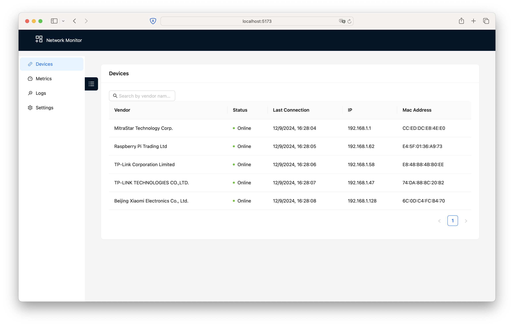
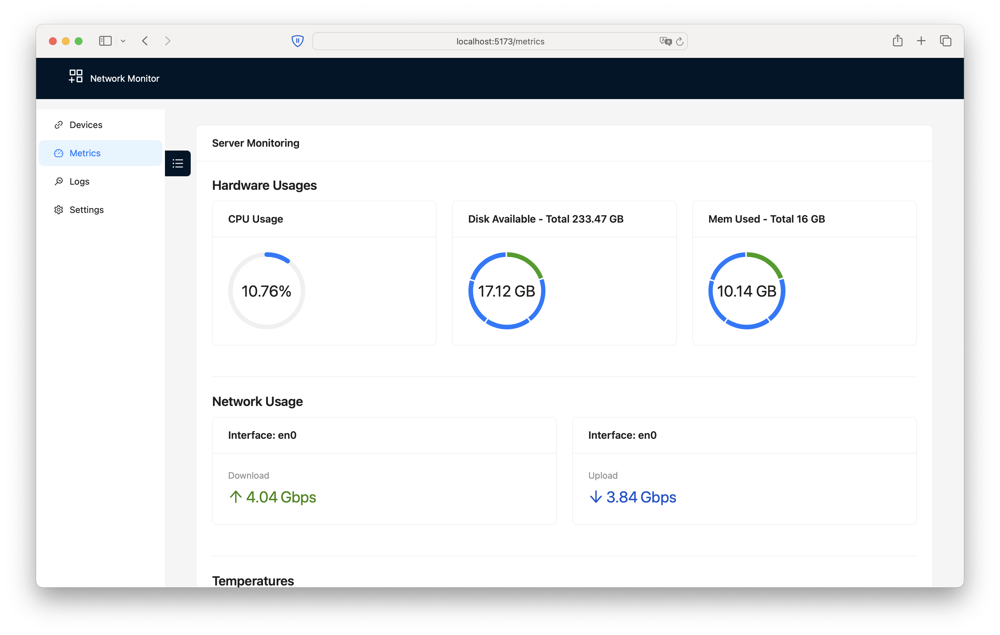
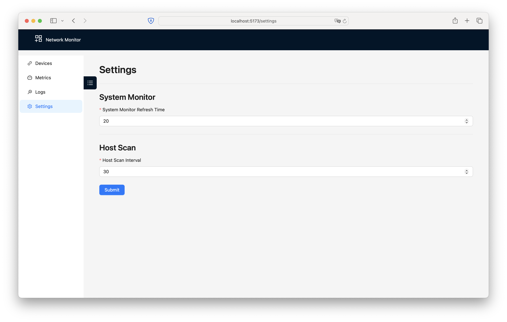

# 🌐 Network Monitoring Dashboard 📊

Welcome to **Network Monitoring Dashboard** — a powerful and user-friendly tool to monitor and manage the devices connected to your network. Built with Rust, this dashboard connects seamlessly with the NATS message queue and provides real-time insights into system health metrics, such as **CPU usage**, **temperature**, **disk usage**, and **network bandwidth**.

## 🚀 Features

- **Device Discovery:** Automatically detect and monitor devices connected to your network.
- **Real-time Metrics:** View live statistics for:
    - **CPU Usage**
    - **Temperature**
    - **Disk Usage**
    - **Network Bandwidth**
- **NATS Queue Integration:** The dashboard subscribes to the NATS queue for seamless communication with your devices, ensuring up-to-date system information.
- **Settings Customization:** Tweak the settings of:
    - **Device Discovery**: Fine-tune how devices are identified and tracked on the network.
    - **Metrics System**: Control how often and what kind of metrics are gathered.

## 🔮 Future Features

- **Docker support**: Provide Docker support to launch the whole system including Rust services.
- **Log Component**: Connect to the queue and retrieve the logs from the different services into a single screen.
- **Notifications System**: Get alerts when important events happen, via:
    - **Telegram**
    - **Slack**
    - **HTTP Webhooks**
- **Device History:** View a detailed log of previously connected devices to track changes over time.

## 🛠 Installation

1. Clone the repository:
   ```bash
   git clone https://github.com/albertjimenez/NetworkMonitor.git
   ```
2. Create an `.env` file with this content or expose the following environment variables
```dotenv
# Replace the value with the actual NATS URL
VITE_NATS_URL=ws://localhost:8080
```
3. Run `yarn` or `npm` to launch it
    ```bash
   npm dev
   # or
   yarn dev
    ```

## ⚙️ Usage

Once the dashboard is running, open your browser and navigate to http://localhost:5173 to view the real-time metrics and device list.

You can adjust the discovery settings and the frequency of metrics collection from the dashboard's settings panel.

## 📈 Dashboard Overview

The dashboard provides key system metrics in real-time:

- **CPU Usage**: Displays current CPU usage across all cores.
- **Temperature**: Tracks the device's temperature if supported.
- **Disk Usage**: Shows total and used disk space.
- **RAM Usage**: Shows total and used memory.
- **Network Bandwidth**: Provides live stats on bandwidth usage.
- **Devices**: Lists all the currently connected devices.

## 📷 Screenshots
### Devices screen
To view the current offline/online devices with a search functionality to filter them by name.

### Metrics screen
Displays the metrics from the host system.

### Settings screen
Tweak settings of the time to obtain data for the host discovery and the metrics.

## 🎯 Roadmap

1. [x] Device Discovery
2. [x] Real-time System Monitoring
3. [ ] Notification System (Telegram, Slack, Webhooks)
4. [ ] Device History View

Stay tuned for more exciting features!

## 🤝 Contributing

Feel free to contribute to this project! Fork the repository and submit a pull request with your feature or bug fix.

## 📄 License

This project is licensed under the MIT License - see the LICENSE.md file for details.

## ✨ Support

If you find this project helpful, please consider giving it a ⭐ on GitHub! You can also open an issue if you encounter any problems or have suggestions for improvement.

Made with ❤️ by Albert Sendrós
